# GIT Assignments

## Assignment - 2

Problem Definition

- Create a branch from the master branch and make changes and commit changes 

Step - 1 : Initializing Assignment-2 folder, adding and commiting main.java
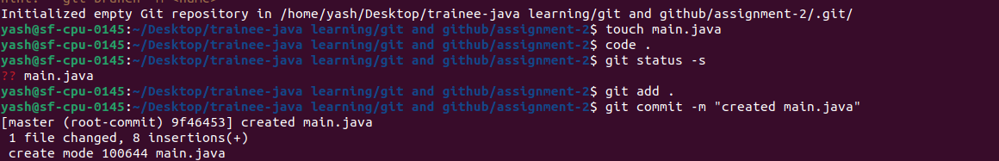

Step - 2 : Creating new branch assignment2_dev and Commit changes
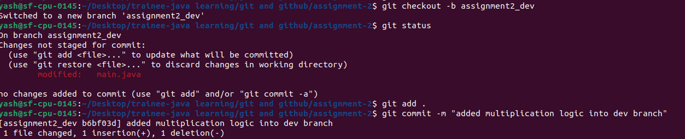

Step - 3 : Push Code from Master branch into remote repo
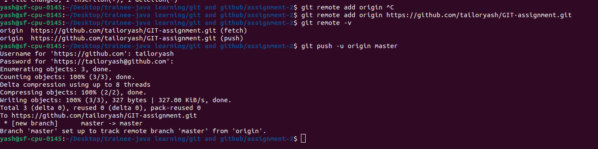

Step - 4 : Pushed Code 
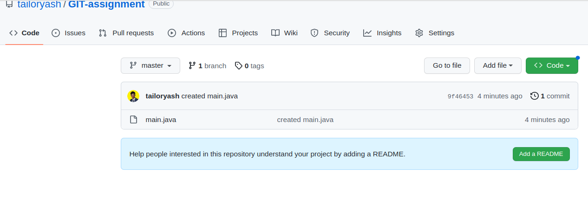

- Create a pull request for the first branch and merge it to the master.

Step - 1 : Pushing code of Assignment2_dev branch into remote repo
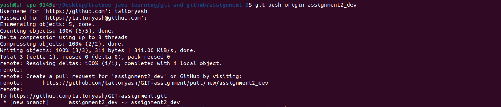 

Step - 2 : Pushed Code
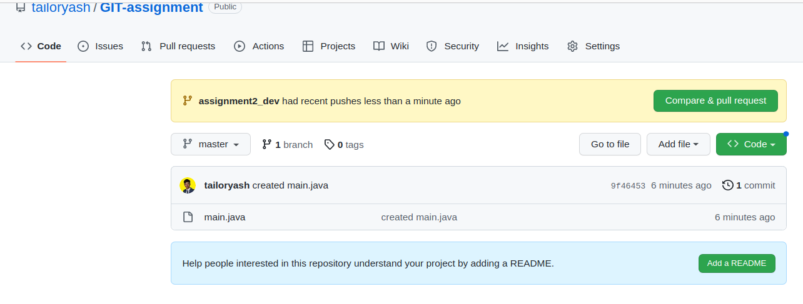 

Step - 3 : Open a Pull Request
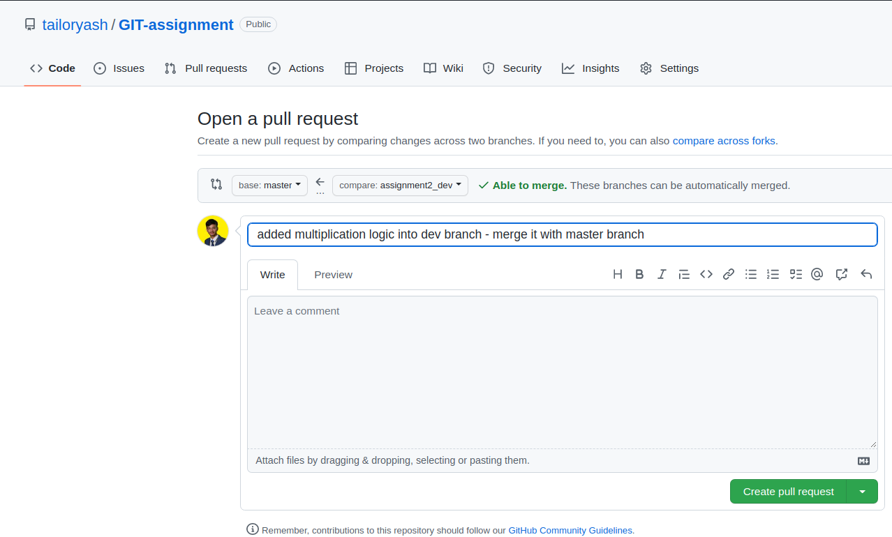 

Step - 4 : Requested PR
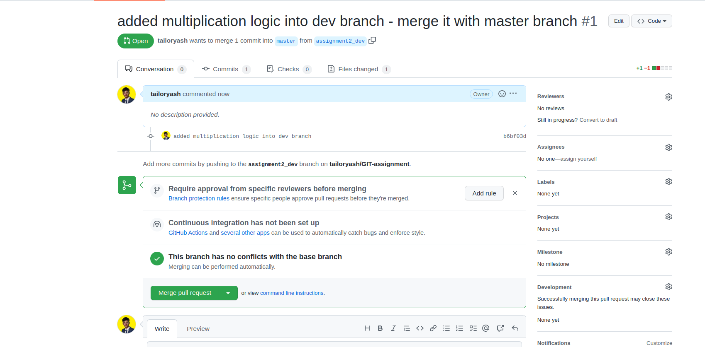 

Step -  5: Merge it with Master branch
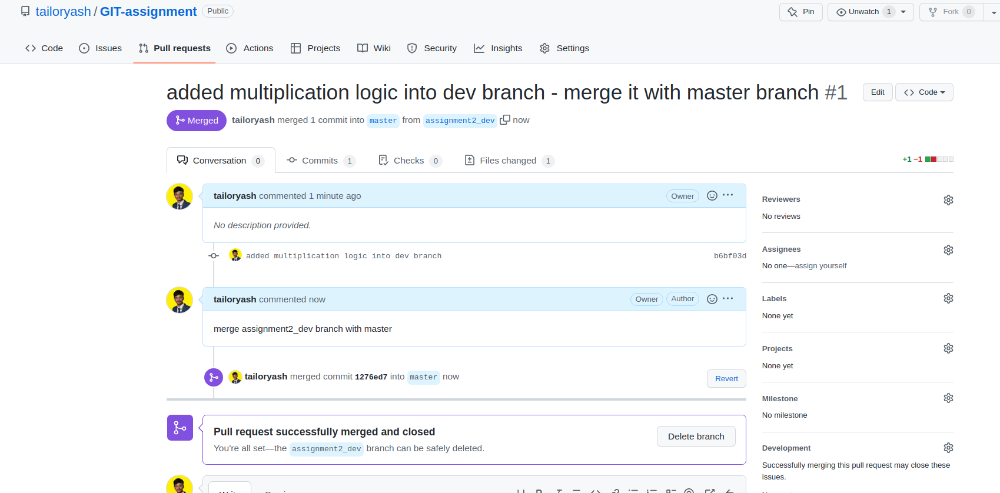 

- Create a new branch from the master.

- Rebase the second branch with the master branch and make changes in the second m branch and commit changes

Step - 1 : Few changes in Second branch and commit
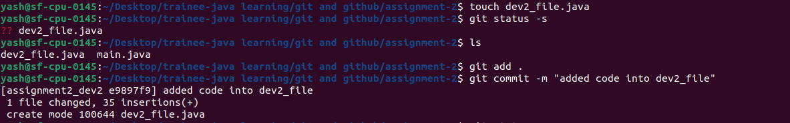

Step - 2 : Log before rebase 
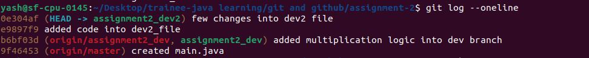

Step - 3 : Resolved Conflicts and Log after rebase
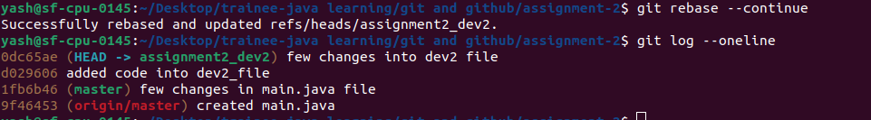

## END